# Agent-UniRAG Research Reproduction & Cybersecurity Extension

> Independent reproduction, retrieval analysis, multi-hop decomposition experiments, and a relationship-aware cybersecurity extension of **Agent-UniRAG**.

[](#research-status)
[](#environment)
[](#system-architecture)

---

## Overview

This repository contains an experimental research implementation built around **Agent-UniRAG**, with two goals:

1. **Reproduce and analyze retrieval behavior** on the MuSiQue multi-hop benchmark.
2. **Extend the retrieval framework to structured cybersecurity knowledge** using MITRE ATT&CK.

The project focuses on a practical research question:

> When does lexical retrieval, semantic reranking, and multi-hop decomposition actually help?

The experiments separate:

- candidate generation,
- E5 semantic reranking,
- controlled/oracle decomposition,
- automatic decomposition,
- relationship-aware cybersecurity retrieval.

The repository is intentionally explicit about **positive and negative results**. In particular, the controlled MuSiQue decomposition experiments improved retrieval metrics, while the small local automatic planner was not reliable enough for large-scale autonomous evaluation. On the structured MITRE ATT&CK edge-retrieval pilot, BM25 already achieved perfect retrieval, so E5 added latency without improving accuracy.

---

#
## 📄 Research Paper

<p align="center">
  <a href="docs/agent-unirag-research-paper.pdf">
    
  </a>
</p>

**[Read the complete research paper →](docs/agent-unirag-research-paper.pdf)**

The paper documents the actual project end-to-end: Agent-UniRAG retrieval reproduction, E5 reranking, four-hop diagnosis, controlled decomposition, the Qwen2.5-0.5B planner pilot, MITRE ATT&CK corpus construction, relationship-aware cybersecurity retrieval, results, limitations, and reproducibility.

## 🧭 README Diagrams

These diagrams are stored as standalone SVG assets so they render directly on GitHub.

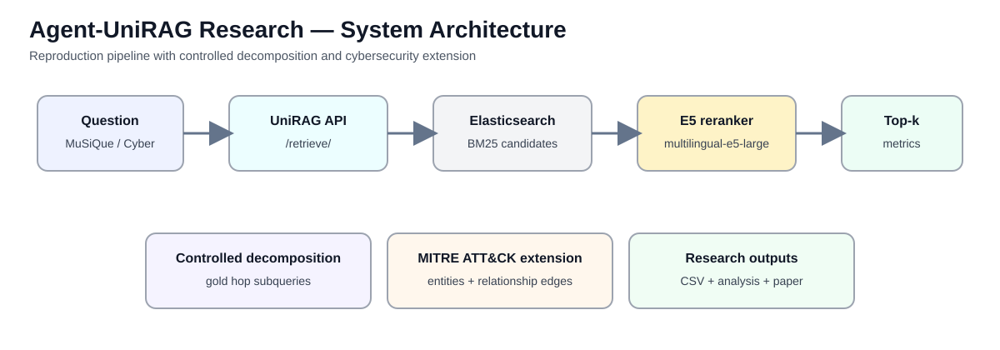

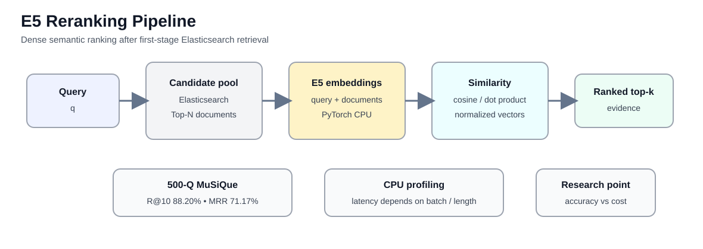

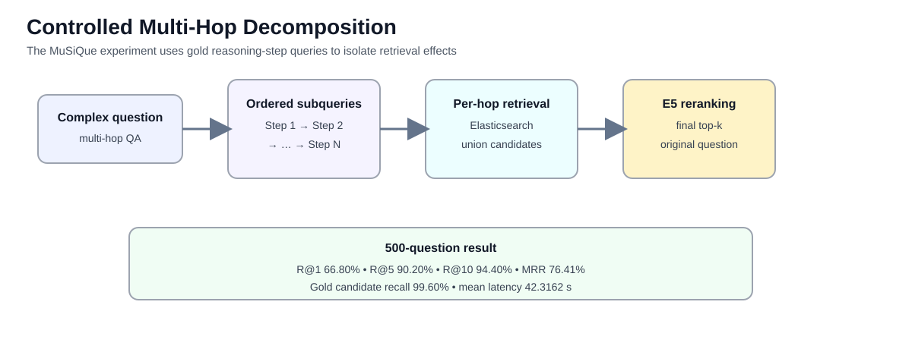

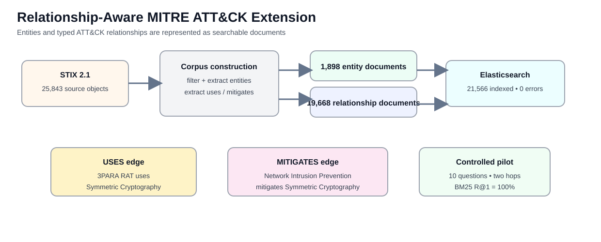

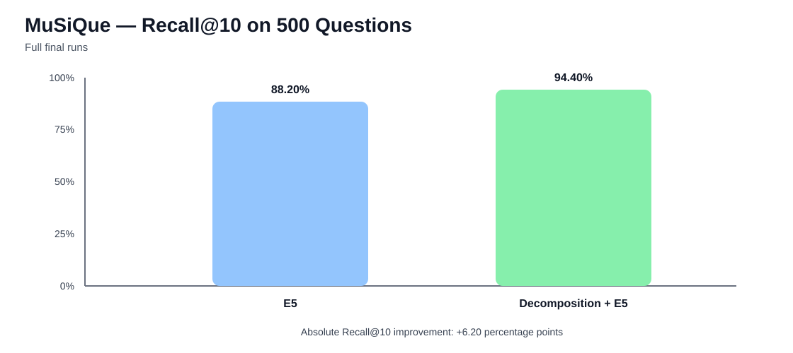


# Research Status

### Core experiments completed

- ✅ Agent-UniRAG retrieval reproduction/analysis
- ✅ Four-hop failure diagnosis
- ✅ CPU multilingual-E5 reranking
- ✅ E5 profiling across batch size and sequence length
- ✅ Full 500-question MuSiQue E5 evaluation
- ✅ Full 500-question controlled decomposition + E5 evaluation
- ✅ Automatic decomposition pilot with Qwen2.5-0.5B-Instruct
- ✅ MITRE ATT&CK Enterprise corpus construction
- ✅ Relationship-aware MITRE ATT&CK indexing
- ✅ UniRAG API retrieval against the cybersecurity corpus
- ✅ Controlled 10-question cybersecurity relationship-hop evaluation
- ✅ Git checkpoints and reproducibility artifacts

---


## 🛠️ Tooling Used in the Project

The repository documents the actual tools used during implementation and evaluation:

| Tool | Purpose |
|---|---|
| **Python** | Experiment scripts, corpus construction, evaluation, diagnostics |
| **PowerShell** | Windows execution, service checks, API tests, Git workflow |
| **Conda** | Local `agent-unirag` environment |
| **Agent-UniRAG** | Upstream retrieval/RAG framework reproduced and extended |
| **Elasticsearch 7.10.2** | First-stage lexical retrieval and indexing |
| **FastAPI retrieval service** | `/retrieve/` HTTP retrieval boundary |
| **Requests** | Python HTTP calls to the local retriever |
| **Hugging Face Transformers** | E5 and Qwen model loading/inference |
| **PyTorch** | CPU inference and embedding computation |
| **multilingual-e5-large** | Dense semantic reranking |
| **Qwen2.5-0.5B-Instruct** | Automatic decomposition pilot |
| **MuSiQue** | 500-question multi-hop evaluation |
| **MITRE ATT&CK / STIX 2.1** | Structured cybersecurity knowledge and relationships |
| **Git / GitHub** | Version control and reproducibility checkpoints |

# 1. Why This Project?

Retrieval-augmented generation systems can fail for very different reasons.

A model may have:

- a poor first-stage candidate set,
- a good candidate set but weak ranking,
- difficulty following a multi-hop reasoning chain,
- or a planner that generates incorrect intermediate queries.

Treating every failure as "the retriever is bad" hides these distinctions.

This project therefore decomposes the retrieval problem into measurable components.

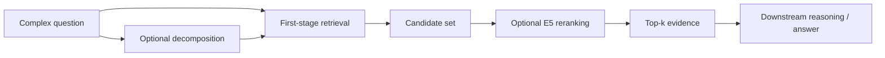

---

# 2. Research Questions

### RQ1 — Reproduction

Can the Agent-UniRAG retrieval pipeline be reproduced and independently evaluated?

### RQ2 — Semantic reranking

Does multilingual E5 reranking improve retrieval quality over the Elasticsearch lexical baseline?

### RQ3 — Multi-hop retrieval

How does retrieval behave on difficult multi-hop MuSiQue questions?

### RQ4 — Decomposition

Does controlled query decomposition improve multi-hop retrieval?

### RQ5 — Cybersecurity transfer

Can the same retrieval framework operate over structured cybersecurity knowledge?

### RQ6 — Relationship-aware retrieval

How do BM25 and E5 behave when the target is an explicit cybersecurity relationship rather than a generic text passage?

---

# 3. System Architecture

The project preserves the existing UniRAG retrieval interface and adds experimental components around it.

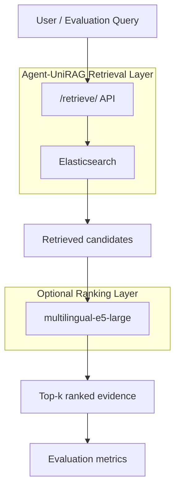

### Core technologies

| Component | Role |
|---|---|
| Agent-UniRAG | Retrieval/RAG framework being reproduced and extended |
| Elasticsearch | First-stage lexical retrieval |
| multilingual-e5-large | Dense semantic reranking |
| MuSiQue | Multi-hop QA evaluation |
| MITRE ATT&CK | Structured cybersecurity knowledge |
| STIX | Machine-readable ATT&CK representation |
| Qwen2.5-0.5B-Instruct | Automatic decomposition pilot |

---

# 4. Repository Structure

```text
agent-unirag-research/
│
├── original/
│   └── Agent-UniRAG/
│       └── upstream reproduction target
│
├── reproduction/
│   ├── experiments/
│   │   ├── cpu_dense_reranker.py
│   │   ├── evaluate_musique_e5.py
│   │   ├── evaluate_musique_decomposition_e5.py
│   │   ├── automatic_decomposer_test.py
│   │   ├── benchmark_e5_cpu.py
│   │   ├── benchmark_e5_real.py
│   │   ├── benchmark_e5_seq_length.py
│   │   ├── profile_e5_real_query.py
│   │   ├── four_hop_decomposition.py
│   │   ├── evaluate_cyber_hops.py
│   │   └── ...
│   │
│   ├── cybersecurity/
│   │   ├── build_mitre_corpus.py
│   │   ├── index_mitre_attack.py
│   │   ├── build_cyber_benchmark.py
│   │   ├── evaluate_cyber_retrieval.py
│   │   └── evaluate_cyber_hops.py
│   │
│   ├── results/
│   │   ├── musique_e5_results.csv
│   │   ├── musique_decomposition_e5_results.csv
│   │   ├── cyber_retrieval_results.csv
│   │   ├── cyber_hop_results.csv
│   │   └── ...
│   │
│   └── diagnose_four_hop_failures.py
│
├── cyber_data/
│   ├── raw/
│   │   └── enterprise-attack-19.1.json
│   │
│   └── processed/
│       ├── mitre_attack.jsonl
│       └── cyber_benchmark.json
│
└── README.md
```

> The raw MITRE ATT&CK STIX bundle is treated as local corpus data and is not intended to be committed to Git history.

---

# 5. Environment

The experiments were developed in a local Windows/Conda environment.

Observed environment:

```text
Conda environment: agent-unirag

transformers: 4.46.3
torch:        2.4.1+cpu

transformers available: True
torch available:        True
openai available:       False
ollama available:       False
```

Local services:

```text
Elasticsearch: http://127.0.0.1:9200
UniRAG API:    http://127.0.0.1:8000
```

A Windows certificate-store problem affected some Python SSL imports. Experimental scripts therefore include a local certificate-store workaround. This is an environment/reproducibility workaround, not a research contribution.

---

# 6. MuSiQue Reproduction

The main reproduction uses the MuSiQue development subsample:

```text
dev_500_subsampled.jsonl
```

The experimental pattern is:


## Full 500-question E5 result

| Metric | E5 result |
|---|---:|
| Evaluated | 500 |
| Recall@1 | **62.60%** |
| Recall@5 | **82.40%** |
| Recall@10 | **88.20%** |
| MRR | **71.17%** |
| Mean latency | **43.2863 s** |

Result file:

```text
reproduction/results/musique_e5_results.csv
```

---

# 7. Controlled Multi-Hop Decomposition

A second experiment uses known/gold decomposition information to test whether splitting complex multi-hop questions into sequential retrieval steps can improve the candidate set.

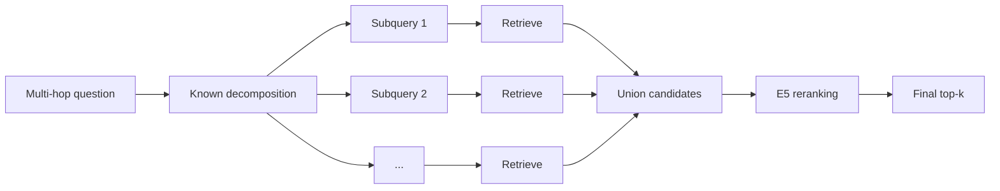

## Full 500-question result

| Metric | Controlled decomposition + E5 |
|---|---:|
| Evaluated | 500 |
| Gold candidate recall | **99.60%** |
| Recall@1 | **66.80%** |
| Recall@5 | **90.20%** |
| Recall@10 | **94.40%** |
| MRR | **76.41%** |
| Mean latency | **42.3162 s** |

Result file:

```text
reproduction/results/musique_decomposition_e5_results.csv
```

### Observed improvement over the 500-question E5 run

| Metric | E5 | Decomposition + E5 | Absolute change |
|---|---:|---:|---:|
| Recall@1 | 62.60% | 66.80% | **+4.20 pp** |
| Recall@5 | 82.40% | 90.20% | **+7.80 pp** |
| Recall@10 | 88.20% | 94.40% | **+6.20 pp** |
| MRR | 71.17% | 76.41% | **+5.24 pp** |

The decomposition result is a **controlled/oracle experiment**. It should not be described as autonomous planning.

---

# 8. Why Candidate Recall Matters

One of the most useful diagnostics in this project is separating:

```text
candidate generation
        ↓
candidate contains gold?
        ↓
reranking
        ↓
gold appears near the top?
```

A reranker cannot recover a passage that was never retrieved.

This is why the decomposition experiment tracks **gold candidate recall** separately from final Recall@k.

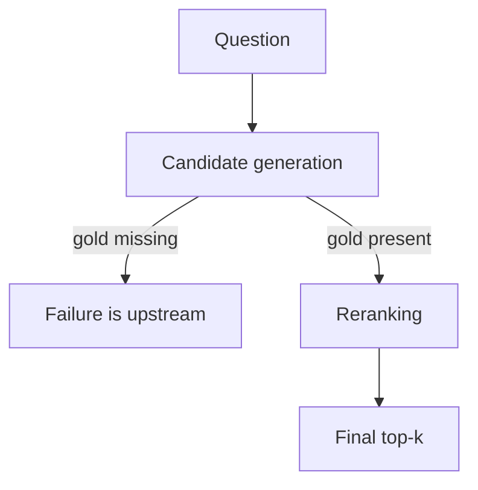

---

# 9. E5 CPU Profiling

The dense reranker was evaluated under CPU-only conditions.

## Batch-size benchmark

| Batch size | Observed latency |
|---:|---:|
| 8 | **42.456 s** |
| 16 | **47.949 s** |
| 32 | **57.439 s** |

On this environment, larger batch sizes did not improve end-to-end latency.

## Sequence-length benchmark

| Max sequence length | Observed latency |
|---:|---:|
| 128 | **31.559 s** |
| 256 | **37.583 s** |
| 384 | **41.455 s** |
| 512 | **41.659 s** |

This suggests that shorter sequence lengths can reduce CPU latency, while longer contexts add cost without necessarily producing proportional retrieval gains.

> These timings are environment-specific and should not be generalized to GPU deployments.

---

# 10. Automatic Decomposition Pilot

A local planner based on:

```text
Qwen2.5-0.5B-Instruct
```

was tested as an automatic decomposition model.

The planner was intentionally constrained to return a structured next-search query.

Example expected output:

```json
{
  "query": "Which company operates the CBC stations?"
}
```

However, the 0.5B planner exhibited failures including:

- malformed/free-form output,
- repeated queries,
- premature attempts to answer the final question,
- unresolved placeholders,
- incorrect sequential dependencies.

### Result

The automatic planner was tested on a **5-question validation pilot** and was **not scaled to 500 questions**.

This is an important negative result:

> Controlled decomposition demonstrates the retrieval potential of sequential query decomposition, but a very small local planner is not reliable enough to realize that strategy autonomously.

The project therefore does not claim successful autonomous decomposition.

---

# 11. Cybersecurity Extension

The retrieval framework was extended to **MITRE ATT&CK Enterprise**.

The goal was not to build a complete SOC assistant. Instead, the experiment asks:

> Can a general retrieval pipeline operate over a structured cybersecurity knowledge graph when the relationships themselves are made searchable?

---

# 12. MITRE ATT&CK Corpus

The project uses the pinned:

```text
enterprise-attack-19.1.json
```

STIX bundle.

Observed source size:

```text
25,843 STIX objects
```

After filtering:

### Entity documents

```text
1,898
```

| Entity type | Count |
|---|---:|
| attack-pattern | 697 |
| campaign | 56 |
| course-of-action | 44 |
| intrusion-set | 174 |
| malware | 726 |
| tool | 95 |
| x-mitre-data-component | 106 |

### Relationship documents

```text
19,668
```

| Relationship | Count |
|---|---:|
| uses | 18,220 |
| mitigates | 1,448 |

### Final indexed corpus

```text
21,566 documents
21,566 indexed
0 indexing errors
```

---

# 13. Why Relationship Documents Were Added

The initial cybersecurity corpus contained only ATT&CK entities.

That was not enough for a multi-hop retrieval experiment because the graph edges were not directly represented as searchable documents.

The corpus was therefore redesigned to include:

```text
Entity:
    APT38

Relationship:
    APT38 uses Scheduled Task

Entity:
    Scheduled Task

Relationship:
    Network Intrusion Prevention mitigates Scheduled Task
```

The resulting representation is:

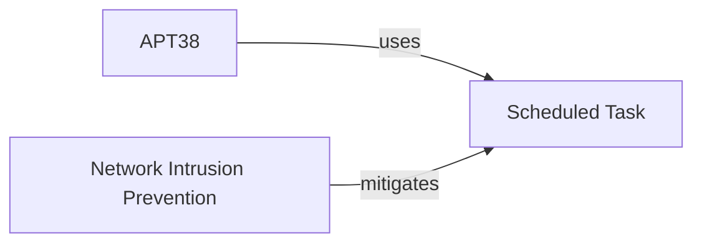

This makes the relationships retrievable through the same UniRAG interface used for text retrieval.

---

# 14. Cybersecurity Retrieval Example

A direct Elasticsearch diagnostic query demonstrated:

```text
APT38 uses Scheduled Task
```

and:

```text
Network Intrusion Prevention mitigates Scheduled Task
```

For another example:

```text
3PARA RAT
    ↓ uses
Symmetric Cryptography
    ↓ mitigated by
Network Intrusion Prevention
```

The corresponding relationship documents were successfully retrieved from Elasticsearch.

---

# 15. Cybersecurity Benchmark

A small, controlled benchmark of:

```text
10 questions
```

was constructed directly from ATT&CK relationships.

The generator enforces:

- unique source → technique pairs,
- unique questions,
- three-hop gold chains,
- valid ATT&CK object types,
- no direct technique-name leakage in the question,
- deterministic selection,
- structural validation.

Example conceptual chain:

```text
Malware
  ↓
Attack Technique
  ↓
Mitigation
```

The cybersecurity benchmark is intentionally described as a **controlled pilot**, not a statistically comprehensive security benchmark.

---

# 16. Controlled Cybersecurity Hop Evaluation

Rather than relying only on an end-to-end natural-language question, the final security analysis evaluates explicit relationship hops.

### Hop 1

```text
source entity → technique
```

Example:

```text
3PARA RAT → Symmetric Cryptography
```

### Hop 2

```text
mitigation → technique
```

Example:

```text
Network Intrusion Prevention → Symmetric Cryptography
```

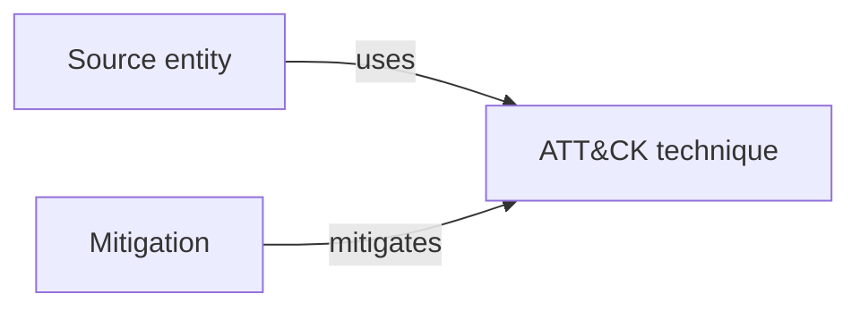

---

# 17. Cybersecurity Results

## Hop 1 — Source → Technique

| Method | R@1 | R@5 | R@10 | MRR |
|---|---:|---:|---:|---:|
| BM25 | **100%** | **100%** | **100%** | **1.0000** |
| BM25 + E5 | **100%** | **100%** | **100%** | **1.0000** |

## Hop 2 — Mitigation → Technique

| Method | R@1 | R@5 | R@10 | MRR |
|---|---:|---:|---:|---:|
| BM25 | **100%** | **100%** | **100%** | **1.0000** |
| BM25 + E5 | **100%** | **100%** | **100%** | **1.0000** |

### Latency observation

Approximate mean per-hop latency observed in this CPU environment:

```text
BM25:       ~0.04 s
BM25 + E5:  ~3.2–3.5 s
```

### Interpretation

On this narrow, controlled ATT&CK relationship-retrieval task:

> BM25 already retrieves the explicit relationship edge at rank 1.

E5 therefore provides **no accuracy improvement** in this experiment while adding substantial CPU latency.

This should not be interpreted as evidence that E5 is generally inferior. It indicates that dense reranking is unnecessary when the retrieval target is an explicitly represented structured relationship whose terms closely match the query.

---

# 18. An Important Failed Experiment

The first cybersecurity end-to-end evaluation produced near-zero scores.

That result was investigated rather than reported as a final model failure.

The diagnosis showed a mismatch between:

```text
gold mitigation entity name
```

and:

```text
relationship document title
```

For example:

```text
gold:
Audit
```

versus:

```text
retrieved relationship:
Audit mitigates Scheduled Task
```

The evaluator was therefore corrected to understand relationship documents.

This is an example of why the project tracks the evaluation pipeline itself—not only the model.

---

# 19. Reproducibility Workflow

### Start Elasticsearch

```text
http://127.0.0.1:9200
```

### Start the UniRAG API

```text
http://127.0.0.1:8000
```

### Example retrieval request

PowerShell:

```powershell
$body = @{
    retrieval_method = "retrieve_from_elasticsearch"
    query_text = "APT38 Scheduled Task"
    max_hits_count = 10
    document_type = "paragraph_text"
    corpus_name = "mitre_attack"
} | ConvertTo-Json

Invoke-RestMethod `
    -Uri "http://127.0.0.1:8000/retrieve/" `
    -Method Post `
    -ContentType "application/json" `
    -Body $body
```

Expected evidence includes a relationship such as:

```text
APT38 uses Scheduled Task
```

---

# 20. Rebuild the MITRE Corpus

```powershell
C:\Users\annoy\miniconda3\Scripts\conda.exe run `
    --no-capture-output `
    -n agent-unirag `
    python .\reproduction\cybersecurity\build_mitre_corpus.py
```

Expected output structure:

```text
Entity documents: 1898
Relationship documents: 19668
Total documents: 21566
```

---

# 21. Index MITRE ATT&CK

```powershell
C:\Users\annoy\miniconda3\Scripts\conda.exe run `
    --no-capture-output `
    -n agent-unirag `
    python .\reproduction\cybersecurity\index_mitre_attack.py
```

Expected final verification:

```text
Documents indexed: 21566
Errors: 0
Elasticsearch count: 21566
```

---

# 22. Run MuSiQue E5 Evaluation

```powershell
C:\Users\annoy\miniconda3\Scripts\conda.exe run `
    --no-capture-output `
    -n agent-unirag `
    python .\reproduction\experiments\evaluate_musique_e5.py
```

---

# 23. Run Controlled Decomposition + E5

```powershell
C:\Users\annoy\miniconda3\Scripts\conda.exe run `
    --no-capture-output `
    -n agent-unirag `
    python .\reproduction\experiments\evaluate_musique_decomposition_e5.py
```

---

# 24. Run Cybersecurity Hop Evaluation

```powershell
C:\Users\annoy\miniconda3\Scripts\conda.exe run `
    --no-capture-output `
    -n agent-unirag `
    python .\reproduction\cybersecurity\evaluate_cyber_hops.py
```

---

# 25. Results at a Glance

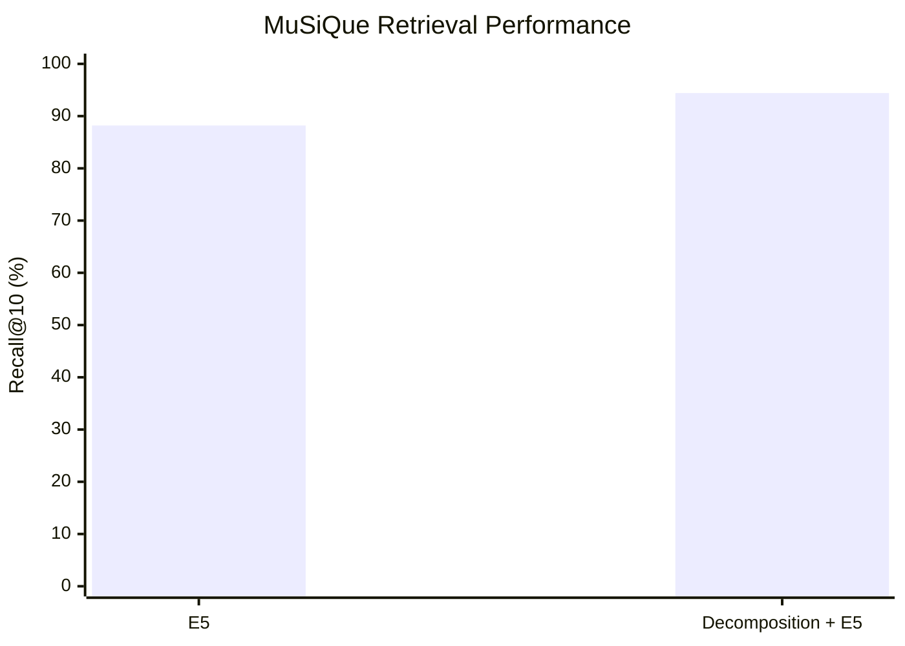

### MuSiQue

```text
E5:
R@1   62.60%
R@5   82.40%
R@10  88.20%
MRR   71.17%

Decomposition + E5:
R@1   66.80%
R@5   90.20%
R@10  94.40%
MRR   76.41%
```

### Cybersecurity relationship pilot

```text
BM25:
Hop 1 R@1 = 100%
Hop 2 R@1 = 100%

BM25 + E5:
Hop 1 R@1 = 100%
Hop 2 R@1 = 100%
```

The experiments therefore suggest that:

```text
generic multi-hop text retrieval
        → decomposition + semantic reranking can help

explicit ATT&CK relationship retrieval
        → lexical retrieval may already be sufficient
```

---

# 26. Key Findings

### Finding 1 — E5 helps on the reproduced MuSiQue workload

The 500-question E5 run reached:

```text
88.20% Recall@10
71.17% MRR
```

### Finding 2 — Controlled decomposition helps multi-hop retrieval

Using known decomposition steps increased:

```text
Recall@10:
88.20% → 94.40%

MRR:
71.17% → 76.41%
```

### Finding 3 — Candidate coverage matters

Controlled decomposition achieved:

```text
99.60% gold candidate recall
```

This indicates that much of the remaining ranking problem can be separated from the candidate-generation problem.

### Finding 4 — Tiny automatic planners are unreliable

The Qwen2.5-0.5B pilot did not reliably produce sequential retrieval plans, so autonomous decomposition was not scaled to the full benchmark.

### Finding 5 — Structured cybersecurity retrieval behaves differently

Once ATT&CK relationship edges were explicitly indexed, BM25 retrieved the required edges perfectly on the controlled 10-question hop benchmark.

### Finding 6 — Dense reranking has a cost

On CPU, E5 added seconds of latency per hop without improving accuracy in the controlled ATT&CK experiment.

---

# 27. Limitations

This repository is a research prototype, not a production cybersecurity system.

Important limitations:

- The cybersecurity benchmark contains only 10 questions.
- The cybersecurity benchmark is a controlled pilot derived from ATT&CK structure.
- The automatic planner was tested only on a 5-question pilot.
- The decomposition + E5 MuSiQue experiment is oracle/controlled rather than fully autonomous.
- CPU latency is hardware- and environment-dependent.
- MITRE ATT&CK does not represent all cybersecurity knowledge.
- No SOC deployment or analyst user study was performed.
- No production-grade security decision-support claim is made.
- The cybersecurity results should not be interpreted as general cybersecurity QA accuracy.

---

# 28. What This Project Does *Not* Claim

This project does **not** claim:

- universal superiority of E5 over BM25,
- universal superiority of decomposition,
- production-ready autonomous cybersecurity reasoning,
- state-of-the-art cybersecurity retrieval,
- generalized 100% cybersecurity retrieval accuracy,
- that CPU timing here represents GPU or cloud performance.

The goal is empirical analysis under clearly defined experimental conditions.

---

# 29. Reproducibility and Research Integrity

The repository keeps separate artifacts for:

```text
implementation
experiments
diagnostics
results
```

Important negative findings are retained rather than hidden.

Examples:

```text
Automatic 0.5B planner
→ unreliable

First cyber end-to-end evaluator
→ metric mismatch discovered

Structured ATT&CK relationship retrieval
→ BM25 already sufficient
```

This separation makes it possible to distinguish:

```text
model failure
from
retrieval failure
from
benchmark/evaluator failure
```

---

# 30. Upstream Work

This repository builds on the original Agent-UniRAG project:

**Agent-UniRAG: A Trainable Open-Source LLM Agent Framework for Unified Retrieval-Augmented Generation Systems**

Upstream project:

```text
https://github.com/pvhoang14/Agent-UniRAG
```

The original Agent-UniRAG implementation and research remain the work of their original authors.

---

# 31. References

Primary references to include in the final paper/documentation:

1. Agent-UniRAG original paper and repository.
2. MuSiQue multi-hop QA benchmark.
3. MITRE ATT&CK Enterprise and ATT&CK STIX data.
4. Multilingual E5 / text-embedding research.
5. Relevant multi-hop RAG and query-decomposition literature.
6. Relevant cybersecurity retrieval/RAG literature.

A complete BibTeX file should be maintained separately so paper citations and the README remain synchronized.

---

# 32. Project Outcome

This project produced a reproducible experimental path from:

```text
Agent-UniRAG reproduction
        ↓
E5 reranking analysis
        ↓
multi-hop failure diagnosis
        ↓
controlled decomposition
        ↓
automatic planner pilot
        ↓
MITRE ATT&CK corpus
        ↓
relationship-aware cybersecurity retrieval
```

The main empirical lesson is:

> Retrieval improvements are task-dependent. Dense reranking and decomposition can materially improve difficult multi-hop text retrieval, while explicitly structured cybersecurity relationships can sometimes be retrieved effectively with simple lexical search alone.

---

## License / Attribution

See the upstream Agent-UniRAG repository and the applicable MITRE ATT&CK data licensing/attribution requirements before redistributing upstream code or ATT&CK-derived data.

---

## Status

**Experimental implementation complete. Documentation and research-paper packaging in progress.**
